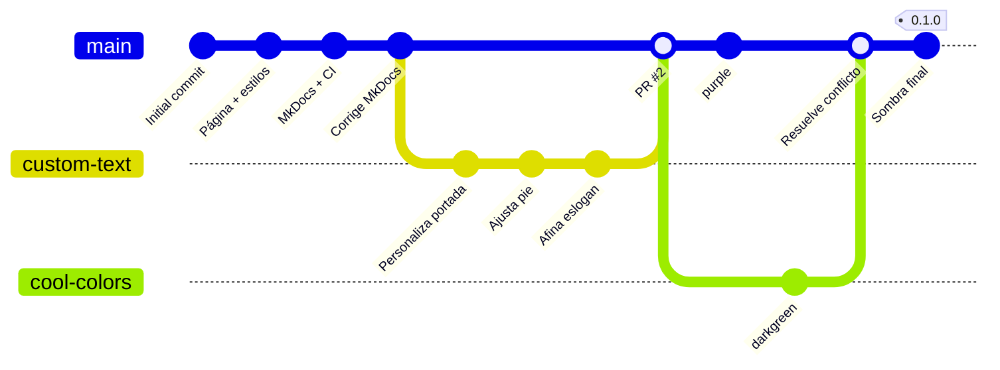

# git-work — Repositorio colaborativo Git

En esta práctica he trabajado un flujo colaborativo completo con Git y GitHub: repositorios remotos, ramas, Issues, Pull Requests, conversación entre usuarios, resolución de conflictos, etiquetas y una release final.

La práctica estaba pensada para dos usuarios, pero yo la he realizado de forma individual. Para poder reproducir el mismo flujo utilicé un segundo repositorio, `git-work-espejo`, para representar el fork y el trabajo de `user2`, tal y como se indica en la guía de la práctica.

## Índice

- [Entorno e instalación](#entorno-e-instalación)
- [Configuración](#configuración)
- [Comprobación](#comprobación)
- [Problemas encontrados y solución](#problemas-encontrados-y-solución)
- [Repositorio remoto](#repositorio-remoto)

## Entorno e instalación

He realizado la práctica en Linux, trabajando dentro de un contenedor Docker.

Durante la práctica he utilizado principalmente:

- Git
- GitHub
- GitHub CLI (`gh`)
- MkDocs
- GitHub Actions

El repositorio principal lo he trabajado desde:

```text
~/dpl/ae1
```

La práctica original está pensada para dos usuarios distintos. Como GitHub no permite hacer fork de un repositorio propio, tuve que adaptar esta parte creando un segundo repositorio:

```text
git-work-espejo
```

Este repositorio hace el papel del fork y hace las funciones de `user2`.

También utilicé un segundo clon:

```text
~/dpl/ae1-user2
```

Al final, los remotos quedaron organizados así:

```text
ae1
├── origin  → git-work
└── espejo  → git-work-espejo

ae1-user2
├── origin   → git-work-espejo
└── upstream → git-work
```

En el clon principal llamé `espejo` al remoto que representa el repositorio de `user2`.

En el segundo clon, `origin` apunta al repositorio espejo y `upstream` apunta al repositorio principal.

Para utilizar el proyecto se puede clonar el repositorio con:

```bash
git clone https://github.com/OOramas/git-work.git
```

y abrir después:

```text
index.html
```

en el navegador.

El árbol final de la práctica queda de la siguiente manera:

```text
ae1/
├── README.md
├── LICENSE
├── .gitignore
├── index.html
├── css/
│   └── cover.css
├── mkdocs.yml
├── docs/
│   └── index.md
├── .github/
│   └── workflows/
│       └── ci.yml
└── comprobaciones.txt
(+ .git)
```

## Configuración

Durante la práctica he trabajado principalmente con estos ficheros:

```text
index.html
css/cover.css
mkdocs.yml
docs/index.md
.github/workflows/ci.yml
```

En `index.html` fui modificando el contenido de la portada de la startup.

En `css/cover.css` trabajé con las líneas correspondientes al color del botón y a su sombra.

El resultado final fue:

```css
color: darkgreen;
text-shadow: 2px 2px 8px lightgreen;
```
Este resultado sale del conflicto que se generó entre las modificaciones de `user1` y `user2` en el proyecto. 

Para la documentación utilicé:

```text
mkdocs.yml
docs/index.md
```

También añadí:

```text
.github/workflows/ci.yml
```

para configurar GitHub Actions.

El workflow comprueba que la documentación de MkDocs se puede construir correctamente mediante:

```bash
mkdocs build --strict
```

## Comprobación

Para comprobar el estado final de la práctica utilizo los comandos asignados por el profesor:

```bash
git log --oneline --graph --all
git status
git remote -v
git tag
git log --format='%an <%ae>' | sort -u
gh pr list --state all
gh issue list --state all
gh release list
```

Las salidas de estas comprobaciones las guardaré también en:

```text
comprobaciones.txt
```

El historial de commits que tenía antes del commit final de documentación era:

```text
8d91e15 Añade sombra al botón principal y cierra la issue #2
befd517 Resuelve el conflicto de cover.css
06fcf1a Cambia el color del botón principal a verde oscuro
ae63e03 Cambia el color del botón principal a morado
afdcfba Merge pull request #2 from OOramas/custom-text
93eee9f Afina el eslogan de la portada
4a4ecd7 Ajusta el texto del pie de página
1972606 Personaliza la portada para la startup
8e04478 Corrige enlace de portada para validación MkDocs
bda380c Añade documentación con MkDocs e integración continua
4ec1f87 Añade la página de la startup y su hoja de estilos
a557222 Initial commit
```

La etiqueta que creé fue:

```text
0.1.0
```

y quedó apuntando al commit:

```text
8d91e15
```

La numeración real de mis Issues y Pull Requests quedó así:

```text
#1 → Issue: Add custom text for startup contents
#2 → Pull Request: Personaliza la portada para la startup
#3 → Issue: Improve UX with cool colors
#4 → Pull Request: Improve UX with cool colors
```

En mi repositorio esta numeración no coincide con la que aparece en algunos pasos de la práctica. Después de crear la Issue `#1`, mi primer Pull Request recibió el número `#2`. A partir de ahí, la segunda Issue pasó a ser la `#3` y el segundo Pull Request el `#4`.

Por eso, cuando los números de la práctica no coincidían con los de mi repositorio, utilicé siempre la numeración real que me había asignado GitHub.

### Historial gráfico

He añadido también un esquema del historial para visualizar cómo se fueron separando y uniendo las ramas durante la práctica.



## Problemas encontrados y solución

Durante la práctica me encontré bastantes problemas. Algunos eran errores míos al utilizar por primera vez Git y GitHub, y otros aparecieron por tener que adaptar una práctica pensada para dos usuarios a una única cuenta. Para ello me ayudé de la documentación aportada para la práctica y consulté a chatGPT cuando no entendía por qué me daba ciertos fallos.

| Problema | Causa | Cómo lo solucioné |
|---|---|---|
| `Permission denied (publickey)` al utilizar SSH | No tenía configurada una clave SSH válida para GitHub en este entorno | Cambié los remotos y trabajé mediante HTTPS |
| No podía hacer fork de mi propio repositorio | Estaba realizando la práctica con una sola cuenta de GitHub | Creé `git-work-espejo` para representar el fork y el trabajo de `user2` |
| El primer `push` por HTTPS rechazó mi contraseña | GitHub ya no permite utilizar la contraseña normal de la cuenta para hacer operaciones Git | Utilicé un Personal Access Token |
| GitHub rechazó inicialmente el workflow | El primer TOKEN que utilicé no tenía permiso `workflow` | Utilicé otro token con el permiso necesario |
| GitHub Actions falló al principio | `docs/index.md` tenía un enlace a `../index.html` que MkDocs no podía resolver con `--strict` | Corregí la documentación comentando el enlace que me daba problemas y volví a hacer `push`; el siguiente workflow terminó correctamente |
| `gh` no estaba instalado | GitHub CLI no estaba disponible inicialmente en el entorno donde estaba trabajando | Como daba dos opciones, intenté ir siempre por la que no necesitaba gh, ya que no sabía muy bien cómo instalarlo en el docker, pero en este punto decidí instalar GitHub CLI |
| Git mostró `dubious ownership` | Estaba accediendo desde el sistema anfitrión a un repositorio cuyo propietario era otro usuario | Añadí el repositorio como `safe.directory` |
| Apareció `Author identity unknown` en `ae1-user2` | No había configurado todavía mi nombre y correo de Git en ese segundo clon | Configuré `user.name` y `user.email` localmente |
| No podía crear el PR directamente desde `git-work-espejo` | El repositorio espejo es un repositorio independiente y no un fork real relacionado con `git-work` | Publiqué la rama también en `git-work` y abrí el Pull Request desde esa rama |
| `gh` no sabía qué repositorio utilizar | En algunos clones tenía más de un remoto configurado | Utilicé `gh repo set-default` y seleccioné `OOramas/git-work` |
| La práctica hablaba del PR `#1`, pero el mío era el `#2` | La numeración real de mi repositorio no coincidía con la utilizada en algunos pasos de la práctica | Comprobé el número real con `gh pr list` y utilicé el `#2` |
| GitHub no me dejó aprobar el Pull Request | Al trabajar con una única cuenta, yo mismo aparecía como autor y revisor del PR | No pude hacer una aprobación formal, así que documenté esta limitación en mi diario y continué con la fusión |
| `git push` devolvió `fetch first` | Desde `user1` había subido un nuevo commit a la rama y el clon de `user2` todavía no lo tenía | Hice `git fetch` y después `git rebase` antes de volver a hacer `push` |
| Tuve un conflicto en `css/cover.css` | Desde `user1` había puesto `purple` y desde `user2` había puesto `darkgreen` en la misma línea | Abrí el fichero, eliminé las marcas del conflicto y conservé `darkgreen`, tal como indicaba la práctica |
| La Issue de los colores no se cerró automáticamente | El commit de la secuencia ofrecida por el profesor contenía `Closes #2`, pero en mi repositorio esa Issue era realmente la `#3` | La comprobé con `gh issue list` y la cerré manualmente con `gh issue close 3` |
| No encontraba fácilmente la opción `Releases` en la web de GitHub | No localicé la opción al buscarla desde github.com | Utilicé la alternativa desde terminal con `gh release create` |

## Repositorio remoto

El repositorio principal es:

https://github.com/OOramas/git-work

El Pull Request principal de la práctica es:

https://github.com/OOramas/git-work/pull/2

El repositorio espejo que utilicé para representar el fork de `user2` es:

https://github.com/OOramas/git-work-espejo
